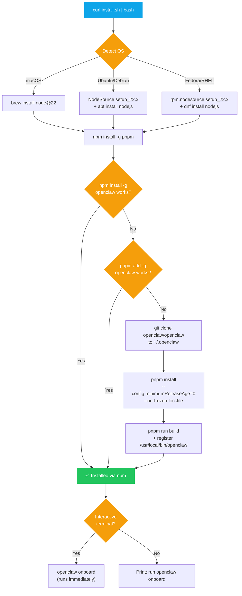
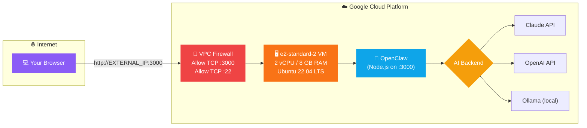

# openclaw-guide

One-click installer script for [OpenClaw AI](https://openclaw.ai) on **macOS**, **Ubuntu/Debian**, and **Fedora/RHEL**.

No Docker. No manual dependency wrangling. Just run the script and go.

---

## ⚡ What is OpenClaw?

[OpenClaw](https://openclaw.ai) is an open-source personal AI assistant with **357k+ GitHub stars** — and growing fast. It connects to models like Claude, GPT, and local LLMs to browse the web, write code, manage files, and automate tasks on your behalf. Think of it as an AI agent that actually *does* things, not just chats.

This repo gives you `install.sh` — a single script that gets OpenClaw running on your machine in under two minutes.

---

## 🚀 Quick Start

```bash
curl -fsSL https://raw.githubusercontent.com/deepakpathik/openclaw-desktop/main/install.sh | bash
```

Or clone and run locally:

```bash
git clone https://github.com/deepakpathik/openclaw-desktop.git
cd openclaw-desktop
bash install.sh
```

That's it. The script handles everything else.

---

## 🔧 What the Installer Does

The script auto-detects your OS and runs through these steps:

| Step | Action | Why |
|------|--------|-----|
| 1 | Detect OS (macOS / Ubuntu/Debian / Fedora/RHEL) | Pick the right package manager and install paths |
| 2 | Check Node.js version | OpenClaw requires Node ≥ 22 (v22.14.0+) |
| 3 | Install or upgrade Node to v22 | Uses Homebrew (macOS), NodeSource (Debian), or dnf (Fedora) |
| 4 | Install `pnpm` globally via npm | OpenClaw is a pnpm workspace — npm alone won't work |
| 5 | Try `npm install -g openclaw` | Fastest path — global npm install |
| 6 | Try `pnpm add -g openclaw` | Second attempt if npm global fails |
| 7 | Fallback: clone source + build | Clones `openclaw/openclaw` to `~/.openclaw`, runs `pnpm install --config.minimumReleaseAge=0 --no-frozen-lockfile`, builds, and registers a launcher at `/usr/local/bin/openclaw` |
| 8 | Prompt for onboarding | If running interactively, asks to run `openclaw onboard` immediately |

### Installation Flow



---

## 📋 Prerequisites

**Nothing.** The script installs everything it needs — Node.js v22, pnpm, and OpenClaw itself.

If you already have Node installed, the script checks the version and upgrades to v22 if it's older. On macOS, it installs Homebrew first if missing.

```bash
# Optional: check your current Node version
node -v
# v22.x? Great, the script skips the install. Older or missing? It handles it.
```

### Supported Platforms

| OS | Tested Versions | Package Manager |
|----|-----------------|-----------------|
| macOS | 13 Ventura, 14 Sonoma, 15 Sequoia | Homebrew |
| Ubuntu/Debian | 22.04 LTS, 24.04 LTS | apt (NodeSource) |
| Fedora/RHEL | 39, 40, 41 | dnf (NodeSource) |

---

## ☁️ Cloud Deployment — Google Cloud

Want OpenClaw running 24/7? Deploy it on a GCP VM. This section walks through the full setup.

> **Why GCP over Oracle Cloud?** Oracle Cloud's Always Free ARM instances (especially Mumbai region) frequently hit capacity limits — you can wait days for a VM to provision. GCP is more reliable for Indian users and most other regions. The $300 free credits cover ~6 months of runtime.

### GCP Network Architecture



### Step 1 — Create the VM

1. Go to [Google Cloud Console](https://console.cloud.google.com)
2. Navigate to **Compute Engine → VM Instances → Create Instance**
3. Configure:

| Setting | Value |
|---------|-------|
| **Name** | `openclaw-vps` |
| **Region** | Pick one close to you (`asia-south1` for India) |
| **Machine type** | `e2-standard-2` (2 vCPU, 8 GB RAM) |
| **Boot disk** | Ubuntu 22.04 LTS, 20 GB SSD (Balanced persistent disk) |
| **Firewall** | ✅ Allow HTTP traffic, ✅ Allow HTTPS traffic |

4. Click **Create** and wait for the VM to spin up

### Step 2 — SSH into the VM

```bash
gcloud compute ssh openclaw-vps --zone=YOUR_ZONE
```

Or click the **SSH** button directly in the Cloud Console.

### Step 3 — System update

```bash
sudo apt update && sudo apt upgrade -y
```

### Step 4 — Install Node.js v22

```bash
curl -fsSL https://deb.nodesource.com/setup_22.x | sudo -E bash -
sudo apt-get install -y nodejs
node -v   # should show v22.x
```

### Step 5 — Install pnpm

```bash
npm install -g pnpm
```

### Step 6 — Clone and install OpenClaw

```bash
GIT_TERMINAL_PROMPT=0 git clone https://github.com/openclaw/openclaw.git
cd openclaw
pnpm install --config.minimumReleaseAge=0 --no-frozen-lockfile
```

> **Why `--config.minimumReleaseAge=0`?** pnpm v10 blocks packages published less than 48 hours ago by default. This CLI flag overrides that restriction. Setting it in `.npmrc` or workspace config does **not** work — it must be passed on the command line.

### Step 7 — Onboard (configure API keys)

```bash
pnpm exec openclaw onboard
```

Follow the interactive wizard to set your AI provider and API key.

### Step 8 — Open firewall port 3000

The VM's external IP won't serve traffic until you open the port in GCP's VPC firewall:

1. Go to **VPC Network → Firewall** in the Cloud Console
2. Click **Create Firewall Rule**
3. Configure:

| Setting | Value |
|---------|-------|
| **Name** | `allow-openclaw` |
| **Direction** | Ingress |
| **Targets** | All instances in the network |
| **Source IP ranges** | `0.0.0.0/0` (or restrict to your IP) |
| **Protocols and ports** | TCP: `3000` |

4. Click **Create**

> **Tip:** For production, restrict the source IP range to your own IP or put Nginx/Caddy in front with HTTPS instead of exposing port 3000 directly.

### Step 9 — Verify

```bash
# Start the gateway
pnpm exec openclaw gateway start

# In another terminal, check it's alive:
curl http://localhost:3000
```

Then open `http://YOUR_VM_EXTERNAL_IP:3000` in your browser. You should see the OpenClaw dashboard.

---

## 🐛 Troubleshooting / Known Issues

Every problem below was hit during real installations. If you're installing manually, you **will** encounter at least one of these.

| # | Problem | Symptom | Fix |
|---|---------|---------|-----|
| 1 | **pnpm `minimumReleaseAge` blocks packages** | `pnpm install` fails with errors about `follow-redirects`, `koffi`, or other packages being "too new". pnpm v10 enforces a 48-hour age restriction on registry packages by default. | Pass `--config.minimumReleaseAge=0` as a **CLI flag**. This is critical — `.npmrc` settings and `pnpm config set` do **not** work because OpenClaw's workspace config overrides them. The CLI flag has the highest priority. |
| 2 | **Node.js version too old** | `pnpm install` succeeds with a warning you might miss. Then at runtime: `SyntaxError: Invalid regular expression flags`. This happens because Node 18 doesn't support syntax that Node 22 introduced. | Upgrade to Node 22 via NodeSource: `curl -fsSL https://deb.nodesource.com/setup_22.x \| sudo -E bash -` then `sudo apt-get install -y nodejs`. Verify with `node -v`. |
| 3 | **`git clone` asks for username/password** | Cloning a public repo prompts for credentials, then fails with `fatal: Authentication failed`. GitHub removed password authentication in August 2021. | Prefix the clone command with `GIT_TERMINAL_PROMPT=0` to skip the prompt and force HTTPS without auth: `GIT_TERMINAL_PROMPT=0 git clone https://github.com/openclaw/openclaw.git` |
| 4 | **Wrong repository name** | `git clone` returns 404. Common mistake: using `OpenClawAI/OpenClaw` or other capitalization variants. | The correct repo is **`github.com/openclaw/openclaw`** (all lowercase). |
| 5 | **`pnpm dev` exits immediately** | You run `pnpm dev` expecting a web server, but it prints CLI help text and exits with code 0. | `pnpm dev` launches the CLI tool, not a server. To start the actual server, run `pnpm exec openclaw gateway start` — that's what binds to port 3000. |

### Why does the `.npmrc` fix not work? (Issue #1 deep dive)

This one is worth explaining because it's counter-intuitive. pnpm v10 introduced `minimumReleaseAge` as a security feature. You'd expect this to work:

```bash
# ❌ None of these work:
echo "minimum-release-age=0" >> .npmrc
pnpm config set minimumReleaseAge 0
```

But OpenClaw's monorepo has its own workspace configuration that **overrides** user-level and project-level `.npmrc` settings. The only way to guarantee the override is the CLI flag, which has the highest priority in pnpm's config hierarchy:

```bash
# ✅ This works:
pnpm install --config.minimumReleaseAge=0 --no-frozen-lockfile
```

### The easy way

Don't want to deal with any of this? The one-click installer handles **all five issues** automatically — Node version detection and upgrade, correct repo URL, the pnpm CLI flag, and proper gateway startup. Just run the script and skip the headache.

---

## 🖥 Commands After Install

Once installed, OpenClaw gives you three main commands:

### First-time setup

```bash
openclaw onboard
```

Interactive wizard — sets your AI provider, API keys, and preferences. The installer prompts you to run this automatically if you're in an interactive terminal.

### Start the agent gateway

```bash
openclaw gateway
```

Starts the backend agent server. This is what actually runs your AI tasks and binds to port 3000.

### Open the dashboard

```bash
openclaw dashboard
```

Opens the web UI at `http://localhost:3000` where you can chat, manage tasks, and monitor agent activity.

### Connect messaging apps

Once the gateway is running, you can talk to OpenClaw via **WhatsApp**, **Telegram**, **Discord**, **iMessage**, and **Signal**. Configure these in the onboarding wizard or through `openclaw config`.

### Other handy commands

```bash
openclaw --version           # Check installed version
openclaw gateway status      # Is the agent running?
openclaw gateway stop        # Stop the agent
openclaw config show         # View current config
openclaw --help              # Full command list
```

---

## 💰 Cost

| Component | Cost | Notes |
|-----------|------|-------|
| OpenClaw software | **Free** | Open source, MIT license |
| GCP `e2-standard-2` VM | **~$49/mo** | 2 vCPU, 8 GB RAM — fully covered by [GCP $300 free credits](https://cloud.google.com/free) for ~6 months |
| GCP `e2-micro` VM | **Free** | Covered by GCP Always Free tier (1 instance, 30 GB disk) — limited but works for light usage |
| Anthropic Claude API | **Variable** | ~$3 per million input tokens, ~$15 per million output tokens |
| OpenAI GPT-4 API | **Variable** | ~$2.50 per million input tokens, ~$10 per million output tokens |
| Ollama (local models) | **Free** | Runs on your hardware — no API costs |

**Bottom line:** New GCP accounts get **$300 in free credits** — that's roughly 6 months of an `e2-standard-2` VM at no cost. After that, you can downgrade to `e2-micro` (always free) or pay ~$49/mo. The AI API costs depend on usage, but most personal use is a few dollars per month.

---

## 📁 Repository Structure

```
openclaw-desktop/
├── install.sh          ← The one-click installer (this is the whole point)
├── README.md           ← You are here
├── LICENSE
├── scripts/
│   └── uninstall.sh    ← Full removal script
├── config/
│   └── .env.example    ← Environment variable template
└── docs/
    └── REPORT.md       ← Project report
```

The core is one script. Everything else is documentation.

---

## 🤝 Contributing

Found a bug? OS not supported? Open an issue or send a PR.

The script is intentionally a single file — keep it that way. No build system, no dependencies, no framework. Just bash.

---

## 📄 License

MIT — do whatever you want with it.
