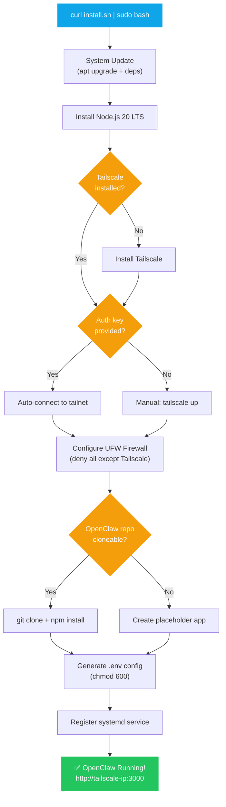
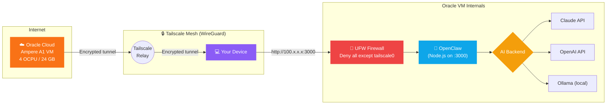

# OpenClaw — Oracle Cloud Free Tier Hosting

One-click deployment of OpenClaw AI Agent on Oracle Cloud Always Free ARM instances.

## 🚀 One-Click Install

SSH into your Oracle Cloud VM, then run:

```bash
curl -fsSL https://raw.githubusercontent.com/deepakpathik/openclaw-guide/main/install.sh | sudo bash
```

Or with a Tailscale auth key (fully unattended):

```bash
export TAILSCALE_AUTHKEY="tskey-auth-xxxxx"
curl -fsSL https://raw.githubusercontent.com/deepakpathik/openclaw-guide/main/install.sh | sudo bash
```

## 🏗 What the Installer Does

| Step | Action | Tool / Technology |
|------|--------|-------------------|
| 1 | System update & prerequisites | `apt-get` |
| 2 | Node.js 20 LTS installation | NodeSource repo |
| 3 | Tailscale VPN installation & auth | Tailscale official installer |
| 4 | UFW firewall hardening | `ufw` (allow only `tailscale0`) |
| 5 | OpenClaw clone & `npm install` | `git` + `npm` |
| 6 | `.env` config file generation | bash heredoc |
| 7 | systemd service registration | `systemctl enable` + `start` |

### Installation Flow



### Network Architecture



## ☁️ Oracle Cloud Setup (Pre-requisites)

1. Sign up at [cloud.oracle.com](https://cloud.oracle.com) (credit card required for verification)
2. Upgrade to **Pay-As-You-Go** (still free — needed for ARM capacity)
3. Create an **Ampere A1** VM:
   - Shape: `VM.Standard.A1.Flex`
   - OCPUs: 4 | RAM: 24 GB
   - OS: Ubuntu 22.04 (ARM)
4. Open port 22 in the OCI Network Security List (temporarily, for initial SSH)

### Free Tier Resources

| Resource | Specification | Cost |
|---|---|---|
| Compute Shape | VM.Standard.A1.Flex (ARM Ampere) | **FREE** |
| OCPUs | 4 vCPUs | **FREE** |
| RAM | 24 GB | **FREE** |
| Storage | 200 GB Block Volume | **FREE** |
| OS | Ubuntu 22.04 LTS (ARM64) | **FREE** |
| Networking | 10 TB/month outbound | **FREE** |

## 📁 Repository Structure

```
openclaw-guide/
├── install.sh          ← One-click installer (main entry point)
├── README.md
├── scripts/
│   ├── update.sh       ← Pull latest OpenClaw + restart service
│   └── uninstall.sh    ← Full removal script
├── config/
│   └── .env.example    ← Environment variable template
└── docs/
    └── REPORT.md       ← Full project report
```

## ⚙️ Configuration

After install, edit `/opt/openclaw/.env`:

```env
PORT=3000

# Choose ONE AI backend:
ANTHROPIC_API_KEY=sk-ant-...   # Paid — Claude API
# OPENAI_API_KEY=sk-...        # Paid — OpenAI
# OLLAMA_BASE_URL=http://localhost:11434  # FREE — local LLM
```

Restart after changes:
```bash
sudo systemctl restart openclaw
```

## 🔒 Security

The system uses **defense in depth** — multiple layers to keep things safe:

| Security Layer | Implementation | Protects Against |
|---|---|---|
| OCI Security List | Block all ingress; allow only SSH for initial setup | Internet port scans |
| UFW Firewall | Default deny; allow `tailscale0` interface only | Direct VM IP attacks |
| Tailscale VPN | WireGuard-based encrypted tunnel; MFA supported | Unauthorized access |
| `.env` Permissions | `chmod 600` applied to `.env` file | File-level API key exposure |
| systemd Hardening | Runs as non-root `ubuntu` user | Privilege escalation |

## ⚡ Performance Tips

- **Cloud AI (Claude / OpenAI):** Best performance — offloads computation to external APIs
- **Local AI (Ollama):** Fully private but slower — runs the LLM on the same VM
- Monitor response times if running everything on one machine

## 💰 Cost Summary

| Component | Monthly Cost | Notes |
|---|---|---|
| Oracle Cloud ARM VM | ₹0 | Always Free — 4 OCPU / 24GB |
| Tailscale VPN | ₹0 | Free for personal use |
| OpenClaw Software | ₹0 | Open source |
| Anthropic Claude API | Variable | ~₹0.80 per 1K input tokens |
| Ollama (local LLMs) | ₹0 | Runs free on same VM |
| **TOTAL (no API usage)** | **₹0 / month** | **Fully free stack possible** |

## 🛠 Useful Commands

```bash
# View live logs
sudo journalctl -u openclaw -f

# Check service status
sudo systemctl status openclaw

# Restart
sudo systemctl restart openclaw

# Update OpenClaw
bash /opt/openclaw/scripts/update.sh

# Uninstall
sudo bash /opt/openclaw/scripts/uninstall.sh
```
