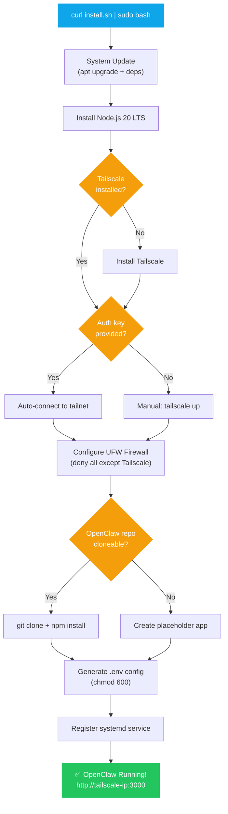
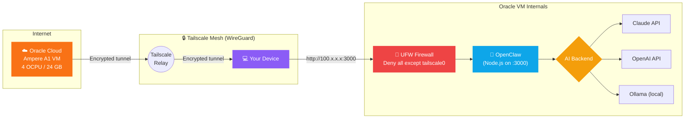

# OpenClaw — Oracle Cloud Free Tier Hosting

One-click deployment of OpenClaw AI Agent on Oracle Cloud Always Free ARM instances.

## 🚀 One-Click Install

SSH into your Oracle Cloud VM, then run:

```bash
curl -fsSL https://raw.githubusercontent.com/deepakpathik/openclaw-guide/main/install.sh | sudo bash
```

Or with a Tailscale auth key (fully unattended):

```bash
export TAILSCALE_AUTHKEY="tskey-auth-xxxxx"
curl -fsSL https://raw.githubusercontent.com/deepakpathik/openclaw-guide/main/install.sh | sudo bash
```

## 🏗 What the Installer Does

| Step | Action |
|------|--------|
| 1 | Updates system packages |
| 2 | Installs Node.js 20 LTS |
| 3 | Installs & configures Tailscale VPN |
| 4 | Configures UFW firewall (blocks all except Tailscale) |
| 5 | Clones & installs OpenClaw |
| 6 | Creates `.env` config file |
| 7 | Registers systemd service (auto-start on reboot) |

### Installation Flow



### Network Architecture



## ☁️ Oracle Cloud Setup (Pre-requisites)

1. Sign up at [cloud.oracle.com](https://cloud.oracle.com) (credit card required for verification)
2. Upgrade to **Pay-As-You-Go** (still free — needed for ARM capacity)
3. Create an **Ampere A1** VM:
   - Shape: `VM.Standard.A1.Flex`
   - OCPUs: 4 | RAM: 24 GB
   - OS: Ubuntu 22.04 (ARM)
4. Open port 22 in the OCI Network Security List (temporarily, for initial SSH)

## 📁 Repository Structure

```
openclaw-oracle/
├── install.sh          ← One-click installer (main entry point)
├── README.md
├── scripts/
│   ├── update.sh       ← Pull latest OpenClaw + restart service
│   └── uninstall.sh    ← Full removal script
├── config/
│   └── .env.example    ← Environment variable template
└── docs/
    └── REPORT.md       ← Full project report
```

## ⚙️ Configuration

After install, edit `/opt/openclaw/.env`:

```env
PORT=3000

# Choose ONE AI backend:
ANTHROPIC_API_KEY=sk-ant-...   # Paid — Claude API
# OPENAI_API_KEY=sk-...        # Paid — OpenAI
# OLLAMA_BASE_URL=http://localhost:11434  # FREE — local LLM
```

Restart after changes:
```bash
sudo systemctl restart openclaw
```

## 🔒 Security Notes

- All traffic is blocked at the firewall except through Tailscale
- SSH is only accessible from your Tailscale IP (100.64.0.0/10)
- `.env` file permissions are set to `600` (owner-read only)

## 💰 Cost Summary

| Component | Cost |
|-----------|------|
| Oracle Cloud ARM VM (4 OCPU / 24GB) | **Free** |
| Tailscale (up to 3 users) | **Free** |
| OpenClaw software | **Free** |
| Anthropic / OpenAI API calls | **Paid per use** |
| Ollama (local LLMs on same VM) | **Free** |

## 🛠 Useful Commands

```bash
# View live logs
sudo journalctl -u openclaw -f

# Check service status
sudo systemctl status openclaw

# Restart
sudo systemctl restart openclaw

# Update OpenClaw
bash /opt/openclaw/scripts/update.sh
```
